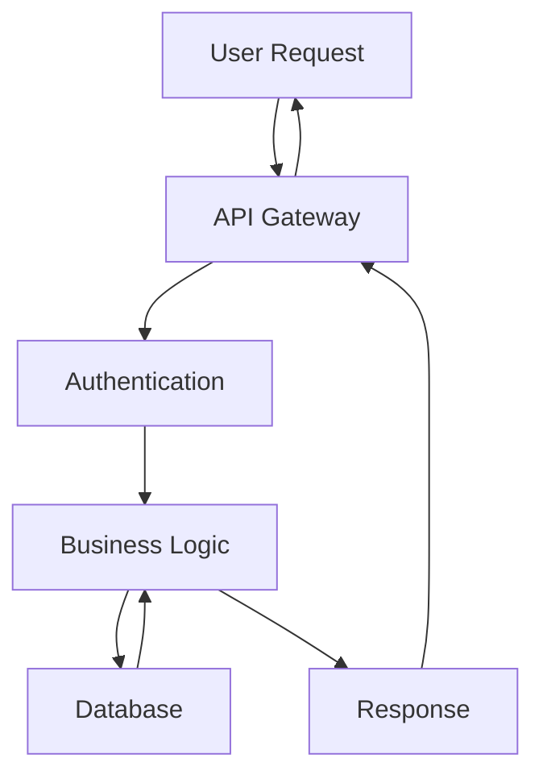

# Project Documentation Structure Template

## Overview
This template provides a standardized structure for creating comprehensive project documentation. It ensures consistency across different projects and makes information easily accessible to team members, stakeholders, and future contributors.

---

## Documentation Standards

### File Naming Convention
```
{index}-{category}-{topic}.md
```

**Examples:**
- `001-architecture-overview.md`
- `002-api-endpoints-specification.md`
- `003-deployment-infrastruture.md`
- `004-testing-strategy.md`

### Directory Organization
```
docs/
├── _plans/                 # Planning documents (indexed)
├── architecture/          # System architecture documentation
├── api/                   # API documentation
├── deployment/            # Deployment and infrastructure
├── development/           # Development guidelines
├── user-guide/           # User-facing documentation
├── troubleshooting/      # Common issues and solutions
└── maintenance/          # Maintenance and operations
```

---

## Document Templates

### 1. Architecture Documentation Template

```markdown
# [Document Title]

## Overview
[Brief description of the architectural component]

## Purpose
[Why this architecture exists and what problem it solves]

## Components
[List and describe main components]

## Data Flow
[How data moves through the system]

## Technology Stack
[Technologies used and why they were chosen]

## Decision Log
[Key architectural decisions with rationale]

## Trade-offs
[What was sacrificed and why]

## Future Considerations
[Scalability, maintenance, evolution]
```

### 2. API Documentation Template

```markdown
# [API Name] Documentation

## Base URL
```
https://api.example.com/v1
```

## Authentication
[Authentication method and requirements]

## Endpoints

### [Method] [Endpoint Path]
**Description:** [What this endpoint does]

**Request:**
```json
{
  "parameter": "type",
  "required": true
}
```

**Response:**
```json
{
  "success": true,
  "data": {}
}
```

**Error Codes:**
- `400` - Bad Request
- `401` - Unauthorized
- `404` - Not Found
- `500` - Internal Server Error

**Example Usage:**
```javascript
const response = await fetch('/endpoint', {
  method: 'POST',
  headers: {
    'Content-Type': 'application/json',
    'Authorization': 'Bearer token'
  },
  body: JSON.stringify(data)
});
```

## Rate Limiting
[Rate limiting policies]

## SDKs & Libraries
[Available client libraries]

## Testing
[How to test the API]
```

### 3. Deployment Documentation Template

```markdown
# [Environment] Deployment Guide

## Prerequisites
[List required tools, permissions, and setup]

## Environment Configuration
[Environment variables and configuration files]

## Deployment Process
### 1. Preparation
[Pre-deployment checks and preparations]

### 2. Build Process
[How to build the application]

### 3. Deployment Steps
[Step-by-step deployment instructions]

### 4. Verification
[How to verify successful deployment]

## Rollback Procedure
[How to rollback if deployment fails]

## Monitoring
[What to monitor after deployment]

## Troubleshooting
[Common deployment issues and solutions]
```

### 4. Development Guide Template

```markdown
# [Project Name] Development Guide

## Getting Started

### Prerequisites
- Node.js 18+
- pnpm 8+
- Git

### Installation
```bash
# Clone repository
git clone [repository-url]
cd [project-name]

# Install dependencies
pnpm install

# Setup environment
cp .env.example .env.local
```

### Development Server
```bash
pnpm dev
```

## Project Structure
[Explain main directories and their purposes]

## Coding Standards
### Naming Conventions
- Components: PascalCase
- Files: kebab-case
- Variables: camelCase

### Code Style
- ESLint configuration
- Prettier formatting
- TypeScript strict mode

## Testing
### Running Tests
```bash
pnpm test
```

### Test Coverage
[Coverage requirements and how to check]

## Git Workflow
### Branch Strategy
- `main` - Production
- `develop` - Development
- `feature/*` - New features
- `hotfix/*` - Critical fixes

### Commit Message Format
```
type(scope): description

feat: add new feature
fix: resolve bug
docs: update documentation
```

## Contributing
[How to contribute to the project]
```

### 5. Troubleshooting Template

```markdown
# Troubleshooting Guide

## Common Issues

### Issue Title
**Symptoms:** [What the user experiences]
**Cause:** [Why it happens]
**Solution:** [How to fix it]

**Steps to Reproduce:**
1. [Step 1]
2. [Step 2]
3. [Step 3]

**Solution:**
```bash
# Command or code fix
```

**Prevention:**
[How to avoid this issue in the future]

---

## Error Codes

### ERROR_CODE_NAME
**Description:** [What this error means]
**Common Causes:** [Why it occurs]
**Resolution:** [How to fix it]

## Debugging Tools
[List available debugging tools and how to use them]

## Getting Help
- Check logs: [where to find logs]
- Contact team: [who to contact]
- Create issue: [link to issue tracker]
```

### 6. Maintenance Template

```markdown
# Maintenance Guide

## Regular Tasks

### Daily
- [ ] Check application health
- [ ] Review error logs
- [ ] Monitor performance metrics

### Weekly
- [ ] Security updates
- [ ] Backup verification
- [ ] Performance analysis

### Monthly
- [ ] Dependency updates
- [ ] Security audit
- [ ] Capacity planning

## Emergency Procedures

### Service Outage
1. [Immediate steps]
2. [Communication plan]
3. [Recovery process]

### Security Incident
1. [Containment]
2. [Investigation]
3. [Resolution]
4. [Post-mortem]

## Performance Monitoring
[What to monitor and acceptable thresholds]

## Backup and Recovery
[Backup procedures and recovery steps]

## Compliance and Auditing
[Compliance requirements and audit procedures]
```

---

## Document Organization Strategy

### Navigation Structure
Create a main index file that links to all documentation:

```markdown
# [Project Name] Documentation

## Getting Started
- [Installation Guide](development/getting-started.md)
- [Development Setup](development/setup.md)

## Architecture
- [System Overview](architecture/overview.md)
- [Database Schema](architecture/database.md)
- [API Design](architecture/api-design.md)

## API Documentation
- [REST API](api/rest-api.md)
- [GraphQL API](api/graphql.md)
- [WebSocket API](api/websocket.md)

## Deployment
- [Development Environment](deployment/development.md)
- [Staging Environment](deployment/staging.md)
- [Production Environment](deployment/production.md)

## Development
- [Coding Standards](development/standards.md)
- [Testing Guide](development/testing.md)
- [Git Workflow](development/git-workflow.md)

## Operations
- [Monitoring](operations/monitoring.md)
- [Troubleshooting](operations/troubleshooting.md)
- [Maintenance](operations/maintenance.md)
```

### Cross-Reference Strategy
Use consistent linking patterns:
```markdown
- Relative links: `[text](./other-file.md)`
- Absolute links: `[text](/path/to/file.md)`
- External links: `[text](https://example.com)`
- Code references: `[component](../src/components/Button.tsx)`
```

---

## Documentation Tools and Automation

### Markdown Extensions
Use these extensions for enhanced documentation:
- **Mermaid diagrams** for flowcharts and sequences
- **Code highlighting** with language specification
- **Tables** for structured data
- **Task lists** for action items

### Example Mermaid Diagram


### Automated Documentation
Set up automated documentation generation:

**API Documentation:**
```yaml
# GitHub Action for API docs
name: Generate API Documentation
on:
  push:
    paths: ['src/api/**']
jobs:
  docs:
    runs-on: ubuntu-latest
    steps:
      - uses: actions/checkout@v2
      - name: Generate OpenAPI docs
        run: npm run generate-api-docs
      - name: Deploy to GitHub Pages
        uses: peaceiris/actions-gh-pages@v3
        with:
          github_token: ${{ secrets.GITHUB_TOKEN }}
          publish_dir: ./docs/api
```

**Architecture Diagrams:**
```bash
# Generate diagrams from code
npx @mermaid-js/mermaid-cli -i architecture.mmd -o architecture.svg
```

---

## Quality Standards

### Documentation Requirements
- **Accuracy**: All information must be current and tested
- **Clarity**: Use simple, direct language
- **Completeness**: Cover all aspects of the topic
- **Consistency**: Follow established patterns and terminology

### Review Process
1. **Draft Creation**: Write initial documentation
2. **Technical Review**: Technical accuracy validation
3. **Peer Review**: Clarity and completeness check
4. **Approval**: Final sign-off by maintainer
5. **Publication**: Deploy to documentation site

### Maintenance Schedule
- **Quarterly Reviews**: Regular accuracy checks
- **Update Triggers**: Documentation updates on code changes
- **Version Control**: Document version compatibility

---

## Accessibility and Usability

### Accessibility Standards
- **Semantic HTML**: Use proper heading hierarchy
- **Alt Text**: Describe images and diagrams
- **Link Text**: Use descriptive link text
- **Color Contrast**: Ensure readable text colors

### Usability Best Practices
- **Searchable Content**: Include keywords and clear titles
- **Scannable Structure**: Use headings, lists, and emphasis
- **Progressive Disclosure**: Start with overview, then details
- **Multiple Formats**: Provide diagrams, code examples, and text

---

## Template Usage Examples

### For Frontend Projects
```markdown
# Component Library Documentation

## Button Component
### Usage
```jsx
<Button variant="primary" onClick={handleClick}>
  Click me
</Button>
```

### Props
| Prop | Type | Default | Description |
|------|------|---------|-------------|
| variant | 'primary' \| 'secondary' | 'primary' | Button style variant |
| size | 'sm' \| 'md' \| 'lg' | 'md' | Button size |
| disabled | boolean | false | Disable the button |
| onClick | function | - | Click handler |

### Examples
[Show different button variants and states]
```

### For Backend Projects
```markdown
# Database Schema Documentation

## Users Table
```sql
CREATE TABLE users (
  id UUID PRIMARY KEY DEFAULT gen_random_uuid(),
  email VARCHAR(255) UNIQUE NOT NULL,
  created_at TIMESTAMP WITH TIME ZONE DEFAULT NOW(),
  updated_at TIMESTAMP WITH TIME ZONE DEFAULT NOW()
);
```

## Indexes
```sql
CREATE INDEX idx_users_email ON users(email);
CREATE INDEX idx_users_created_at ON users(created_at);
```

## Relationships
- `users` → `posts` (one-to-many)
- `users` → `user_sessions` (one-to-many)
```

---

## Integration with Development Workflow

### Pre-commit Hooks
```bash
#!/bin/sh
# .git/hooks/pre-commit

# Check documentation links
npm run check-docs-links

# Validate documentation format
npm run validate-docs

# Generate documentation if needed
npm run generate-docs
```

### CI/CD Integration
```yaml
# Include in your CI pipeline
- name: Validate Documentation
  run: |
    npm run check-docs-format
    npm run check-docs-links
    npm run spell-check-docs

- name: Build Documentation
  run: npm run build-docs

- name: Deploy Documentation
  if: github.ref == 'refs/heads/main'
  run: npm run deploy-docs
```

This documentation structure template provides a comprehensive foundation for maintaining high-quality project documentation that scales with your project and team.