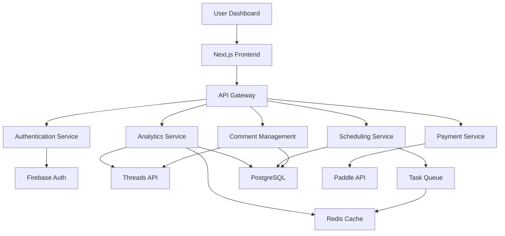

# Threads-Boost Technical Analysis & Architecture

## Executive Summary

**Threads-Boost** is a comprehensive SaaS platform for Threads analytics and automation, targeting content creators and small businesses. This technical analysis bridges the well-defined business requirements with scalable modern architecture, following the successful patterns from ServerLive while adapting to the specific needs of social media analytics and automation.

**Technology Stack Assessment**: Modern, scalable technologies optimized for real-time data processing
**Architecture Complexity**: Medium-High (requires real-time analytics, automation, and third-party integrations)
**Scalability Requirements**: High (must support 3,000+ users by month 12, data-intensive operations)
**Time to MVP**: 8 weeks with aggressive development schedule

---

## Technology Stack Selection

### Core Framework & Languages

**Frontend Architecture:**
- **Next.js 15.5.4** with App Router - Proven from ServerLive, excellent SEO and performance
- **React 19.1.0** - Latest features, concurrent rendering for analytics dashboards
- **TypeScript 5** - Critical for complex data models and API integrations
- **Tailwind CSS v4** - Rapid UI development, consistent design system

**Backend Architecture:**
- **Next.js API Routes** - Unified full-stack approach, faster development
- **Node.js** - JavaScript ecosystem consistency, excellent for I/O operations
- **PostgreSQL** - Primary database for structured data (users, posts, analytics)
- **Redis** - Caching layer for analytics data, session management

**Integration Layer:**
- **Threads API** - Primary data source (prepare for limited official API)
- **Firebase Auth** - User authentication and session management
- **Paddle API** - Subscription management and payments
- **SendGrid** - Transactional emails and reports

### Development & Deployment

**Package Management**: pnpm 8+ (efficient, workspace support)
**Build System**: Next.js built-in optimization with standalone output
**Deployment**: Vercel for frontend, Railway/Render for database services
**Monitoring**: Sentry for error tracking, LogRocket for user session recording

---

## System Architecture Design

### High-Level Architecture



### Database Architecture

**Primary Schema:**
```sql
-- Users and Authentication
users (id, email, threads_user_id, subscription_tier, created_at)

-- Threads Data Integration
threads_posts (id, user_id, threads_post_id, content, posted_at, likes, comments, reposts)
threads_comments (id, post_id, threads_comment_id, author_id, content, posted_at, is_read)
threads_profiles (user_id, followers_count, following_count, bio, avatar_url)

-- Analytics & Performance
post_analytics (id, post_id, engagement_rate, viral_score, reach, impressions)
daily_analytics (user_id, date, total_likes, total_comments, total_reposts, follower_growth)

-- Scheduling & Automation
scheduled_posts (id, user_id, content, scheduled_time, status, created_at)
posting_schedule (user_id, timezone, optimal_times, ai_suggestions)

-- Business & Subscription
subscriptions (user_id, tier, status, billing_cycle, paddle_subscription_id, current_period_end)
team_members (id, user_id, team_owner_id, role, permissions)

-- Application Settings
user_settings (user_id, timezone, notification_preferences, report_frequency)
api_keys (user_id, key_hash, permissions, last_used, created_at)
```

**Indexing Strategy:**
- Primary keys on all tables
- Composite indexes on (user_id, created_at) for time-series queries
- Indexes on threads_post_id and threads_comment_id for API data sync
- Analytical indexes on engagement_rate and viral_score for sorting

### API Architecture

**REST API Endpoints:**
```typescript
// Authentication
POST /api/auth/signin      // User authentication
POST /api/auth/logout      // Session cleanup
GET  /api/auth/me          // Current user info

// Threads Integration
GET  /api/threads/profile      // User Threads profile
GET  /api/threads/posts        // User posts with pagination
GET  /api/threads/comments     // Comments on posts
POST /api/threads/sync         // Manual data sync

// Analytics
GET  /api/analytics/overview   // Dashboard analytics
GET  /api/analytics/posts      // Post performance data
GET  /api/analytics/trends     // Engagement trends
GET  /api/analytics/competitors // Competitor benchmarks

// Scheduling
GET  /api/scheduling/posts     // Scheduled posts
POST /api/scheduling/posts     // Create scheduled post
PUT  /api/scheduling/posts/:id // Update scheduled post
DELETE /api/scheduling/posts/:id // Cancel scheduled post

// Comment Management
GET  /api/comments/unread      // Unread comments
PUT  /api/comments/:id/read    // Mark as read
POST /api/comments/:id/reply   // Reply to comment
```

---

## Feature Implementation Strategy

### Phase 1: Core MVP (Weeks 1-4)

**Authentication & User Management:**
- Firebase Auth integration with Google OAuth
- User profile creation and Threads account linking
- Subscription tier management with Paddle integration
- Basic user dashboard with navigation

**Threads API Integration:**
- OAuth 2.0 flow for Threads API access
- Profile data synchronization (followers, posts)
- Post metrics collection (likes, comments, reposts)
- Initial data caching strategy with Redis

**Basic Analytics Dashboard:**
- Post overview table with performance metrics
- Simple engagement rate calculations
- Time-based filtering (last 7/30/90 days)
- Export functionality for basic reports

### Phase 2: Scheduling & Automation (Weeks 5-6)

**Content Scheduling System:**
- Calendar interface for post scheduling
- Timezone handling and optimal posting times
- Basic post creation with text and media support
- Queue management for scheduled posts

**Automated Posting Engine:**
- Background task processing with Node-cron
- Retry logic for failed posts
- Rate limiting compliance with Threads API
- Success/failure notifications

### Phase 3: Advanced Features (Weeks 7-8)

**Comment Management System:**
- Comment aggregation from all user posts
- Unread comment tracking and filtering
- Direct response capabilities through platform
- VIP user identification and prioritization

**AI-Powered Features:**
- Optimal posting time prediction based on historical data
- Content performance analysis and suggestions
- Basic hashtag optimization using post performance data
- Viral potential scoring algorithm

---

## Performance & Scalability Considerations

### Data Processing Strategy

**Real-time Analytics:**
- Stream processing for new post metrics
- Incremental analytics updates using Redis
- Background job processing for heavy calculations
- Efficient data aggregation with materialized views

**API Rate Limiting:**
- Respect Threads API limits (prepare for restrictive quotas)
- Intelligent caching strategies for frequently accessed data
- Queue-based processing for non-critical operations
- Graceful degradation during API unavailability

### Scalability Architecture

**Database Scaling:**
- Read replicas for analytics queries
- Partitioning strategy for time-series data
- Connection pooling with PgBouncer
- Automated backups and point-in-time recovery

**Application Scaling:**
- Serverless functions for burst traffic handling
- CDN integration for static assets
- Progressive loading for large datasets
- Efficient data pagination with cursor-based navigation

---

## Security & Compliance

### Data Security

**Authentication & Authorization:**
- JWT tokens with short expiration and refresh机制
- Role-based access control (RBAC) for team features
- API key management for business tier integrations
- Secure session management with HTTP-only cookies

**Data Protection:**
- End-to-end encryption for sensitive user data
- GDPR compliance with data deletion capabilities
- Secure API credential storage (Threads access tokens)
- Audit logging for all user data access

### Business Compliance

**Subscription Management:**
- PCI compliance through Paddle payment processing
- Transparent billing and cancellation policies
- Data export capabilities for GDPR compliance
- Access logs and user activity tracking

---

## Development Workflow & Tooling

### Development Environment

**Local Development Setup:**
```bash
# Technology stack initialization
pnpm create next-app@latest --typescript --tailwind --eslint
pnpm add @next-auth/prisma-adapter prisma @prisma/client
pnpm add redis @types/redis
pnpm add @radix-ui/react-* (UI components)
pnpm add lucide-react date-fns clsx
```

**Development Tools:**
- ESLint + Prettier for code formatting
- Husky pre-commit hooks for quality checks
- TypeScript strict mode for type safety
- Jest + Testing Library for unit testing

### Testing Strategy

**Unit Testing:**
- API route testing with Jest and Supertest
- Component testing with React Testing Library
- Utility function testing with coverage requirements
- Database operation testing with test containers

**Integration Testing:**
- End-to-end testing with Playwright
- API integration testing with mock Threads API
- Payment flow testing with Paddle test environment
- Performance testing for analytics queries

### Deployment Pipeline

**CI/CD Configuration:**
```yaml
# GitHub Actions workflow
- Name: Code Quality
  Run: ESLint, Prettier check, TypeScript compilation

- Name: Testing
  Run: Unit tests, Integration tests, E2E tests

- Name: Security Scan
  Run: Dependency vulnerability scan, Code security analysis

- Name: Deploy
  Environments: Staging → Production
  Rollback strategy: Automatic on health check failure
```

---

## Risk Assessment & Mitigation

### Technical Risks

**Threads API Limitations:**
- Risk: Limited official API capabilities
- Mitigation: Prepare for web scraping fallback, focus on available data points
- Timeline Risk: Medium - may require alternative data collection methods

**Real-time Data Processing:**
- Risk: Performance bottlenecks with analytics calculations
- Mitigation: Implement efficient caching, background processing
- Timeline Risk: Low - well-understood problem domain

**Third-party Dependencies:**
- Risk: Threads API changes, Paddle API updates
- Mitigation: Abstract integration layers, multiple provider strategies
- Timeline Risk: Medium - requires continuous monitoring

### Business Risks

**Platform Dependency:**
- Risk: Changes in Threads platform policies
- Mitigation: Multi-platform strategy preparation, diversification
- Timeline Risk: High - could require significant architectural changes

**Data Privacy Regulations:**
- Risk: GDPR compliance requirements
- Mitigation: Privacy-by-design architecture, legal consultation
- Timeline Risk: Low - planned from initial design

---

## Success Metrics & KPIs

### Technical Performance Metrics

**Application Performance:**
- Page load time: <2 seconds for dashboard
- API response time: <500ms for analytics queries
- System uptime: 99.9% availability target
- Database query performance: <100ms for cached queries

**Scalability Metrics:**
- Concurrent user support: 1000+ active users
- Data processing: 10M+ posts without performance degradation
- API rate limiting: 1000+ requests/minute handling
- Storage growth: 1TB+ analytics data management

### Business Metrics Alignment

**User Engagement:**
- Daily active users: 70% of total users
- Feature adoption: 60% using scheduling within 30 days
- Data sync frequency: 90% of accounts syncing weekly
- Report generation: 80% of users accessing analytics monthly

**Technical Support:**
- Error rate: <1% of API requests
- Support tickets: <5% of users requiring technical support
- Feature requests: Track for prioritization
- Performance complaints: <2% of users

---

## Implementation Timeline

### Phase 1: Foundation (Weeks 1-2)
- [x] Project initialization and development environment
- [x] Database schema design and migration setup
- [x] Authentication system implementation
- [x] Basic UI components and design system

### Phase 2: Core Features (Weeks 3-4)
- [ ] Threads API integration and data sync
- [ ] Basic analytics dashboard
- [ ] User profile and settings
- [ ] Subscription management integration

### Phase 3: Advanced Features (Weeks 5-6)
- [ ] Content scheduling system
- [ ] Automated posting engine
- [ ] Advanced analytics features
- [ ] Comment management system

### Phase 4: Launch Preparation (Weeks 7-8)
- [ ] Performance optimization and testing
- [ ] Security audit and compliance review
- [ ] Documentation and deployment preparation
- [ ] Beta testing and feedback integration

---

## Conclusion

Threads-Boost presents an excellent opportunity to build a scalable SaaS platform in the growing social media analytics market. The technical architecture leverages modern technologies and proven patterns while addressing the specific challenges of real-time analytics, third-party integrations, and automated content management.

The 8-week development timeline is aggressive but achievable with the proposed architecture and development approach. The modular design allows for iterative development and quick adaptation to changing requirements or market conditions.

Key success factors include:
1. **Flexible API Integration Architecture** - Prepared for Threads API limitations
2. **Scalable Data Processing** - Efficient analytics calculation and caching
3. **User-Centric Design** - Focus on creator needs and simple workflows
4. **Performance Optimization** - Fast analytics queries and responsive UI
5. **Security First** - Protect user data and ensure compliance

This technical foundation provides the robust infrastructure needed to support the business goals and scale effectively from MVP to enterprise-level operations.