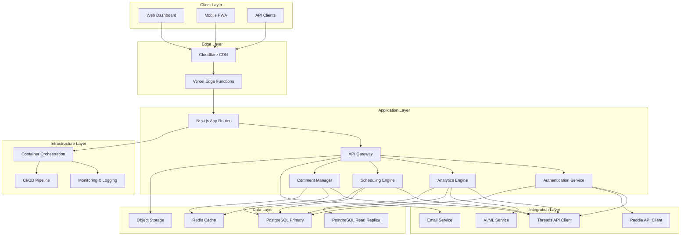
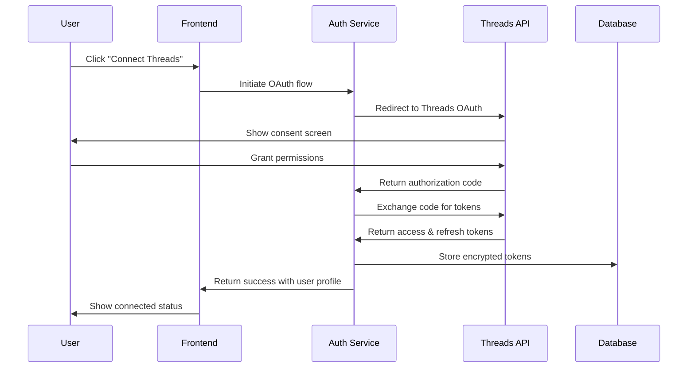
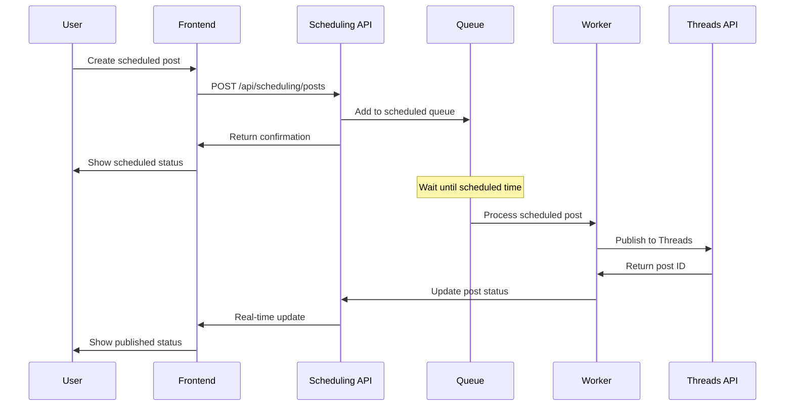

# Threads-Boost System Architecture Design

## Executive Summary

This document outlines the comprehensive system architecture for Threads-Boost, designed to support real-time social media analytics, automated content scheduling, and AI-powered insights. The architecture prioritizes scalability, performance, and maintainability while addressing the unique challenges of third-party API integrations and data-intensive analytics operations.

**Architecture Style**: Microservices-inspired with Next.js full-stack approach
**Scalability Target**: 10,000+ concurrent users, 1M+ posts processed daily
**Data Volume**: 100GB+ analytics data with 1-year retention
**Availability Target**: 99.9% uptime with sub-second response times

---

## High-Level System Architecture

### Overview Diagram



---

## Core Components Architecture

### 1. Frontend Application Layer

**Next.js 15 App Router Architecture:**
```
src/
├── app/                          # Next.js App Router
│   ├── (auth)/                   # Authentication route group
│   │   ├── login/
│   │   └── register/
│   ├── (dashboard)/              # Main application route group
│   │   ├── layout.tsx           # Dashboard shell layout
│   │   ├── page.tsx             # Dashboard overview
│   │   ├── analytics/           # Analytics section
│   │   ├── scheduling/          # Content scheduling
│   │   ├── comments/            # Comment management
│   │   ├── settings/            # User settings
│   │   └── billing/             # Subscription management
│   ├── api/                     # API routes
│   │   ├── auth/
│   │   ├── analytics/
│   │   ├── scheduling/
│   │   ├── comments/
│   │   ├── threads/
│   │   └── users/
│   ├── globals.css
│   ├── layout.tsx              # Root layout
│   ├── not-found.tsx
│   └── error.tsx
├── components/                   # Component library
│   ├── ui/                      # shadcn/ui base components
│   ├── auth/                    # Authentication components
│   ├── dashboard/               # Dashboard-specific components
│   ├── analytics/               # Analytics components
│   ├── scheduling/              # Scheduling components
│   └── comments/                # Comment management
├── lib/                         # Utilities and configuration
│   ├── auth.ts                 # NextAuth configuration
│   ├── db.ts                   # Database connection
│   ├── utils.ts                # Helper functions
│   ├── validations.ts          # Zod schemas
│   └── constants.ts            # Application constants
└── types/                       # TypeScript definitions
    ├── auth.ts
    ├── analytics.ts
    ├── threads.ts
    └── api.ts
```

**Component Architecture Patterns:**

```typescript
// Atomic Design Implementation
interface ComponentProps {
  className?: string;
  children?: React.ReactNode;
}

// Example: Analytics Card Component
interface AnalyticsCardProps extends ComponentProps {
  title: string;
  value: string | number;
  change?: number;
  icon?: React.ReactNode;
  loading?: boolean;
}

const AnalyticsCard: React.FC<AnalyticsCardProps> = ({
  title,
  value,
  change,
  icon,
  loading,
  className,
}) => {
  // Component implementation
};
```

### 2. API Gateway & Routing Architecture

**Route Organization Strategy:**
```typescript
// API Route Structure
// /api/auth/*          - Authentication endpoints
// /api/users/*         - User management
// /api/threads/*       - Threads API integration
// /api/analytics/*     - Analytics data processing
// /api/scheduling/*    - Content scheduling
// /api/comments/*      - Comment management
// /api/subscriptions/* - Billing and subscriptions

// Middleware Stack
export async function middleware(request: NextRequest) {
  // 1. Rate limiting
  // 2. Authentication validation
  // 3. CORS handling
  // 4. Request logging
  // 5. Body validation
}
```

**API Response Architecture:**
```typescript
// Standardized API Response Format
interface ApiResponse<T = any> {
  success: boolean;
  data?: T;
  error?: {
    code: string;
    message: string;
    details?: any;
  };
  meta?: {
    pagination?: {
      page: number;
      limit: number;
      total: number;
      hasMore: boolean;
    };
    timestamp: string;
    requestId: string;
  };
}

// Usage Example
export async function GET(request: NextRequest) {
  try {
    const data = await fetchAnalyticsData();
    return NextResponse.json({
      success: true,
      data,
      meta: {
        timestamp: new Date().toISOString(),
        requestId: generateRequestId(),
      },
    });
  } catch (error) {
    return NextResponse.json({
      success: false,
      error: {
        code: 'ANALYTICS_FETCH_ERROR',
        message: 'Failed to fetch analytics data',
      },
    }, { status: 500 });
  }
}
```

### 3. Database Architecture

**Primary Database Schema (PostgreSQL):**

```sql
-- Core User Management
CREATE TABLE users (
    id UUID PRIMARY KEY DEFAULT gen_random_uuid(),
    email VARCHAR(255) UNIQUE NOT NULL,
    threads_user_id VARCHAR(100),
    threads_username VARCHAR(100),
    threads_access_token TEXT,
    threads_refresh_token TEXT,
    token_expires_at TIMESTAMP,
    subscription_tier VARCHAR(20) DEFAULT 'free',
    subscription_status VARCHAR(20) DEFAULT 'active',
    paddle_subscription_id VARCHAR(100),
    current_period_end TIMESTAMP,
    timezone VARCHAR(50) DEFAULT 'UTC',
    created_at TIMESTAMP WITH TIME ZONE DEFAULT NOW(),
    updated_at TIMESTAMP WITH TIME ZONE DEFAULT NOW(),
    last_sync_at TIMESTAMP
);

-- Threads Data Storage
CREATE TABLE threads_posts (
    id UUID PRIMARY KEY DEFAULT gen_random_uuid(),
    user_id UUID NOT NULL REFERENCES users(id) ON DELETE CASCADE,
    threads_post_id VARCHAR(100) UNIQUE NOT NULL,
    content TEXT,
    media_urls TEXT[],
    posted_at TIMESTAMP WITH TIME ZONE,
    likes_count INTEGER DEFAULT 0,
    comments_count INTEGER DEFAULT 0,
    reposts_count INTEGER DEFAULT 0,
    views_count INTEGER DEFAULT 0,
    engagement_rate DECIMAL(5,4),
    viral_score DECIMAL(5,4),
    created_at TIMESTAMP WITH TIME ZONE DEFAULT NOW(),
    updated_at TIMESTAMP WITH TIME ZONE DEFAULT NOW()
);

CREATE TABLE threads_comments (
    id UUID PRIMARY KEY DEFAULT gen_random_uuid(),
    post_id UUID NOT NULL REFERENCES threads_posts(id) ON DELETE CASCADE,
    threads_comment_id VARCHAR(100) UNIQUE NOT NULL,
    author_id VARCHAR(100),
    author_username VARCHAR(100),
    author_followers_count INTEGER,
    content TEXT,
    posted_at TIMESTAMP WITH TIME ZONE,
    is_read BOOLEAN DEFAULT FALSE,
    is_vip BOOLEAN DEFAULT FALSE,
    is_answered BOOLEAN DEFAULT FALSE,
    created_at TIMESTAMP WITH TIME ZONE DEFAULT NOW()
);

-- Scheduling System
CREATE TABLE scheduled_posts (
    id UUID PRIMARY KEY DEFAULT gen_random_uuid(),
    user_id UUID NOT NULL REFERENCES users(id) ON DELETE CASCADE,
    content TEXT NOT NULL,
    media_urls TEXT[],
    scheduled_time TIMESTAMP WITH TIME ZONE NOT NULL,
    status VARCHAR(20) DEFAULT 'scheduled', -- scheduled, posted, failed
    threads_post_id VARCHAR(100),
    posted_at TIMESTAMP WITH TIME ZONE,
    error_message TEXT,
    retry_count INTEGER DEFAULT 0,
    created_at TIMESTAMP WITH TIME ZONE DEFAULT NOW()
);

-- Analytics Data
CREATE TABLE daily_analytics (
    id UUID PRIMARY KEY DEFAULT gen_random_uuid(),
    user_id UUID NOT NULL REFERENCES users(id) ON DELETE CASCADE,
    date DATE NOT NULL,
    followers_count INTEGER DEFAULT 0,
    following_count INTEGER DEFAULT 0,
    posts_count INTEGER DEFAULT 0,
    total_likes INTEGER DEFAULT 0,
    total_comments INTEGER DEFAULT 0,
    total_reposts INTEGER DEFAULT 0,
    total_views INTEGER DEFAULT 0,
    engagement_rate DECIMAL(5,4),
    new_followers INTEGER DEFAULT 0,
    created_at TIMESTAMP WITH TIME ZONE DEFAULT NOW(),
    UNIQUE(user_id, date)
);

-- User Settings and Preferences
CREATE TABLE user_settings (
    id UUID PRIMARY KEY DEFAULT gen_random_uuid(),
    user_id UUID NOT NULL REFERENCES users(id) ON DELETE CASCADE,
    timezone VARCHAR(50) DEFAULT 'UTC',
    notification_email BOOLEAN DEFAULT TRUE,
    notification_push BOOLEAN DEFAULT TRUE,
    report_frequency VARCHAR(20) DEFAULT 'weekly', -- daily, weekly, monthly
    optimal_times JSONB, -- Array of optimal posting times
    ai_suggestions_enabled BOOLEAN DEFAULT TRUE,
    auto_hashtag BOOLEAN DEFAULT FALSE,
    created_at TIMESTAMP WITH TIME ZONE DEFAULT NOW(),
    updated_at TIMESTAMP WITH TIME ZONE DEFAULT NOW(),
    UNIQUE(user_id)
);

-- Audit and Logging
CREATE TABLE activity_logs (
    id UUID PRIMARY KEY DEFAULT gen_random_uuid(),
    user_id UUID REFERENCES users(id),
    action VARCHAR(100) NOT NULL,
    resource_type VARCHAR(50),
    resource_id VARCHAR(100),
    metadata JSONB,
    ip_address INET,
    user_agent TEXT,
    created_at TIMESTAMP WITH TIME ZONE DEFAULT NOW()
);
```

**Indexing Strategy:**
```sql
-- Performance Indexes
CREATE INDEX idx_users_email ON users(email);
CREATE INDEX idx_users_subscription ON users(subscription_tier, subscription_status);
CREATE INDEX idx_threads_posts_user_id ON threads_posts(user_id DESC);
CREATE INDEX idx_threads_posts_posted_at ON threads_posts(posted_at DESC);
CREATE INDEX idx_threads_posts_engagement ON threads_posts(engagement_rate DESC);
CREATE INDEX idx_threads_comments_post_id ON threads_comments(post_id);
CREATE INDEX idx_threads_comments_unread ON threads_comments(post_id, is_read);
CREATE INDEX idx_scheduled_posts_user_time ON scheduled_posts(user_id, scheduled_time);
CREATE INDEX idx_daily_analytics_user_date ON daily_analytics(user_id, date DESC);
CREATE INDEX idx_activity_logs_user_created ON activity_logs(user_id, created_at DESC);

-- Full-text Search Indexes
CREATE INDEX idx_threads_posts_content_gin ON threads_posts USING gin(to_tsvector('english', content));
CREATE INDEX idx_threads_comments_content_gin ON threads_comments USING gin(to_tsvector('english', content));
```

### 4. Caching Architecture (Redis)

**Caching Strategy:**
```typescript
// Cache Structure Design
interface CacheKeys {
  // User Data (TTL: 1 hour)
  user_profile: `user:profile:${userId}`;
  user_settings: `user:settings:${userId}`;
  user_stats: `user:stats:${userId}`;

  // Threads Data (TTL: 15 minutes)
  user_posts: `user:posts:${userId}`;
  post_analytics: `post:analytics:${postId}`;
  user_comments: `user:comments:${userId}`;

  // Analytics (TTL: 5 minutes)
  daily_analytics: `analytics:daily:${userId}:${date}`;
  engagement_trends: `analytics:trends:${userId}`;
  viral_posts: `analytics:viral:${userId}`;

  // Rate Limiting (TTL: 1 minute)
  api_rate_limit: `ratelimit:${userId}:${endpoint}`;
  threads_api_limit: `threads:ratelimit:${userId}`;

  // Session Data (TTL: 24 hours)
  user_session: `session:${sessionId}`;
  auth_tokens: `auth:tokens:${userId}`;
}

// Cache Implementation
class CacheService {
  private redis: Redis;

  async getUserProfile(userId: string): Promise<UserProfile | null> {
    const cached = await this.redis.get(`user:profile:${userId}`);
    if (cached) return JSON.parse(cached);

    const profile = await db.user.findUnique({ where: { id: userId } });
    if (profile) {
      await this.redis.setex(`user:profile:${userId}`, 3600, JSON.stringify(profile));
    }
    return profile;
  }

  async invalidateUserCache(userId: string): Promise<void> {
    const keys = await this.redis.keys(`user:*:${userId}`);
    if (keys.length > 0) {
      await this.redis.del(...keys);
    }
  }
}
```

### 5. Threads API Integration Architecture

**API Client Design:**
```typescript
class ThreadsApiClient {
  private accessToken: string;
  private refreshToken: string;
  private rateLimiter: RateLimiter;

  constructor(tokens: TokenPair) {
    this.accessToken = tokens.accessToken;
    this.refreshToken = tokens.refreshToken;
    this.rateLimiter = new RateLimiter({
      windowMs: 15 * 60 * 1000, // 15 minutes
      maxRequests: 200, // Conservative limit
    });
  }

  async getUserProfile(): Promise<ThreadsProfile> {
    await this.rateLimiter.waitForSlot();

    try {
      const response = await fetch('https://api.threads.net/v1/me', {
        headers: {
          'Authorization': `Bearer ${this.accessToken}`,
          'Content-Type': 'application/json',
        },
      });

      if (response.status === 401) {
        await this.refreshAccessToken();
        return this.getUserProfile(); // Retry with new token
      }

      return await response.json();
    } catch (error) {
      throw new ThreadsApiError('Failed to fetch user profile', error);
    }
  }

  async getUserPosts(limit: number = 50, before?: string): Promise<ThreadsPost[]> {
    await this.rateLimiter.waitForSlot();

    const params = new URLSearchParams({
      limit: limit.toString(),
      ...(before && { before }),
    });

    const response = await fetch(`https://api.threads.net/v1/me/posts?${params}`, {
      headers: {
        'Authorization': `Bearer ${this.accessToken}`,
      },
    });

    return await response.json();
  }

  private async refreshAccessToken(): Promise<void> {
    const response = await fetch('https://api.threads.net/oauth/access_token', {
      method: 'POST',
      headers: { 'Content-Type': 'application/json' },
      body: JSON.stringify({
        grant_type: 'refresh_token',
        refresh_token: this.refreshToken,
      }),
    });

    const tokens = await response.json();
    this.accessToken = tokens.access_token;
    this.refreshToken = tokens.refresh_token;

    // Update in database
    await updateUserTokens(tokens);
  }
}

// Fallback Strategy for Limited API
class FallbackDataCollector {
  async collectUserData(userId: string): Promise<Partial<ThreadsData>> {
    // Implement web scraping with respect for robots.txt
    // Use rate limiting and respectful delays
    // Cache data aggressively to minimize requests
  }
}
```

### 6. Analytics Processing Architecture

**Real-time Analytics Pipeline:**
```typescript
class AnalyticsProcessor {
  private eventQueue: Queue;
  private cache: CacheService;

  constructor() {
    this.eventQueue = new Queue('analytics-processing', {
      redis: Redis client,
      defaultJobOptions: {
        removeOnComplete: 100,
        removeOnFail: 50,
      },
    });
  }

  async processPostMetrics(postId: string, metrics: PostMetrics): Promise<void> {
    // Calculate engagement rate
    const engagementRate = this.calculateEngagementRate(metrics);

    // Calculate viral score
    const viralScore = this.calculateViralScore(metrics);

    // Update post in database
    await this.updatePostAnalytics(postId, {
      engagementRate,
      viralScore,
      ...metrics,
    });

    // Update daily analytics
    await this.updateDailyAnalytics(postId, metrics);

    // Invalidate relevant cache
    await this.cache.invalidatePostAnalytics(postId);

    // Trigger real-time notifications if significant
    if (viralScore > 0.8) {
      await this.notifyViralPost(postId);
    }
  }

  private calculateEngagementRate(metrics: PostMetrics): number {
    const totalEngagement = metrics.likes + metrics.comments + metrics.reposts;
    const followersCount = metrics.followersCount || 1;
    return totalEngagement / followersCount;
  }

  private calculateViralScore(metrics: PostMetrics): number {
    // Complex algorithm considering:
    // - Engagement velocity (first hour performance)
    // - Comment-to-like ratio
    // - Repost velocity
    // - Follower growth from post
    const engagementVelocity = this.getEngagementVelocity(metrics);
    const commentRatio = metrics.comments / Math.max(metrics.likes, 1);
    const repostRatio = metrics.reposts / Math.max(metrics.likes, 1);

    return Math.min(1, (engagementVelocity * 0.4 + commentRatio * 0.3 + repostRatio * 0.3));
  }
}
```

---

## Data Flow Architecture

### 1. User Authentication Flow



### 2. Data Synchronization Flow

```mermaid
sequenceDiagram
    participant S as Scheduler
    participant API as Threads API
    participant DB as Database
    participant C as Cache
    participant A as Analytics

    every 15 minutes
    S->>API: Fetch user posts
    API->>S: Return posts data
    S->>DB: Upsert posts data
    S->>DB: Update last_sync_at

    loop Each Post
        S->>API: Fetch post comments
        API->>S: Return comments
        S->>DB: Store comments
        S->>A: Queue analytics processing
    end

    S->>C: Invalidate user cache
    A->>C: Update analytics cache
```

### 3. Content Scheduling Flow



---

## Performance Optimization Architecture

### 1. Database Optimization

**Query Optimization Strategies:**
```sql
-- Materialized Views for Complex Analytics
CREATE MATERIALIZED VIEW user_analytics_summary AS
SELECT
    u.id as user_id,
    u.threads_username,
    COUNT(tp.id) as total_posts,
    SUM(tp.likes_count) as total_likes,
    SUM(tp.comments_count) as total_comments,
    SUM(tp.reposts_count) as total_reposts,
    AVG(tp.engagement_rate) as avg_engagement_rate,
    MAX(tp.posted_at) as last_post_date
FROM users u
LEFT JOIN threads_posts tp ON u.id = tp.user_id
WHERE u.subscription_status = 'active'
GROUP BY u.id, u.threads_username;

-- Refresh Strategy
CREATE OR REPLACE FUNCTION refresh_user_analytics()
RETURNS void AS $$
BEGIN
    REFRESH MATERIALIZED VIEW CONCURRENTLY user_analytics_summary;
END;
$$ LANGUAGE plpgsql;

-- Schedule refresh every 5 minutes
```

**Database Connection Management:**
```typescript
// Connection Pool Configuration
const pool = new Pool({
  host: process.env.DB_HOST,
  port: parseInt(process.env.DB_PORT || '5432'),
  database: process.env.DB_NAME,
  user: process.env.DB_USER,
  password: process.env.DB_PASSWORD,
  max: 20, // Maximum connections
  idleTimeoutMillis: 30000,
  connectionTimeoutMillis: 2000,
});

// Read Replica for Analytics Queries
const readOnlyPool = new Pool({
  host: process.env.DB_READ_HOST,
  // ... other config
});

class DatabaseService {
  async getAnalyticsData(userId: string): Promise<AnalyticsData> {
    // Use read replica for analytics queries
    return readOnlyPool.query(`
      SELECT * FROM user_analytics_summary
      WHERE user_id = $1
    `, [userId]);
  }

  async createScheduledPost(postData: ScheduledPost): Promise<void> {
    // Use primary database for writes
    return pool.query(`
      INSERT INTO scheduled_posts (user_id, content, scheduled_time)
      VALUES ($1, $2, $3)
    `, [postData.userId, postData.content, postData.scheduledTime]);
  }
}
```

### 2. Caching Architecture

**Multi-Level Caching Strategy:**
```typescript
class CacheManager {
  private l1Cache: Map<string, any> = new Map(); // Memory cache
  private l2Cache: Redis; // Redis cache
  private l3Cache: CloudflareKV; // Edge cache

  async get<T>(key: string): Promise<T | null> {
    // L1: Memory cache (fastest)
    if (this.l1Cache.has(key)) {
      return this.l1Cache.get(key);
    }

    // L2: Redis cache (fast)
    const redisValue = await this.l2Cache.get(key);
    if (redisValue) {
      const parsed = JSON.parse(redisValue);
      this.l1Cache.set(key, parsed); // Promote to L1
      return parsed;
    }

    // L3: Edge cache (slowest but persistent)
    const edgeValue = await this.l3Cache.get(key);
    if (edgeValue) {
      const parsed = JSON.parse(edgeValue);
      await this.l2Cache.set(key, JSON.stringify(parsed), { ttl: 300 }); // Promote to L2
      this.l1Cache.set(key, parsed); // Promote to L1
      return parsed;
    }

    return null;
  }

  async set<T>(key: string, value: T, options: CacheOptions = {}): Promise<void> {
    const serialized = JSON.stringify(value);

    // Set in all cache layers
    this.l1Cache.set(key, value);

    if (options.ttl) {
      await this.l2Cache.setex(key, options.ttl, serialized);
    } else {
      await this.l2Cache.set(key, serialized);
    }

    if (options.edgeTTL) {
      await this.l3Cache.set(key, serialized, { expirationTtl: options.edgeTTL });
    }
  }
}
```

### 3. API Performance Optimization

**Request Optimization:**
```typescript
// Streaming for Large Datasets
export async function GET(request: NextRequest) {
  const { searchParams } = new URL(request.url);
  const userId = searchParams.get('userId');

  if (!userId) {
    return new Response('User ID required', { status: 400 });
  }

  // Stream response for large datasets
  const encoder = new TextEncoder();
  const stream = new ReadableStream({
    async start(controller) {
      try {
        // Stream analytics data
        for await (const batch of getAnalyticsBatches(userId)) {
          const chunk = JSON.stringify(batch) + '\n';
          controller.enqueue(encoder.encode(chunk));
        }
        controller.close();
      } catch (error) {
        controller.error(error);
      }
    }
  });

  return new Response(stream, {
    headers: {
      'Content-Type': 'application/x-ndjson',
      'Cache-Control': 'public, max-age=300', // 5 minutes
    },
  });
}

// GraphQL-like Query Optimization
export async function POST(request: NextRequest) {
  const { query, variables } = await request.json();

  // Parse query to only fetch requested fields
  const optimizedQuery = optimizeQuery(query);

  // Use DataLoader to batch database queries
  const loader = new DataLoader(async (keys: string[]) => {
    const results = await batchFetchData(keys);
    return keys.map(key => results.find(r => r.id === key));
  });

  const data = await executeQuery(optimizedQuery, variables, loader);

  return Response.json({ data });
}
```

---

## Security Architecture

### 1. Authentication & Authorization

**JWT Token Management:**
```typescript
interface JWTPayload {
  sub: string; // User ID
  email: string;
  subscriptionTier: 'free' | 'creator' | 'professional' | 'business';
  permissions: string[];
  iat: number;
  exp: number;
}

class AuthService {
  generateTokens(user: User): TokenPair {
    const payload: JWTPayload = {
      sub: user.id,
      email: user.email,
      subscriptionTier: user.subscriptionTier,
      permissions: this.getPermissionsForTier(user.subscriptionTier),
      iat: Math.floor(Date.now() / 1000),
      exp: Math.floor(Date.now() / 1000) + (15 * 60), // 15 minutes
    };

    return {
      accessToken: jwt.sign(payload, process.env.JWT_ACCESS_SECRET),
      refreshToken: jwt.sign(
        { sub: user.id },
        process.env.JWT_REFRESH_SECRET,
        { expiresIn: '7d' }
      ),
    };
  }

  private getPermissionsForTier(tier: string): string[] {
    const permissions = {
      free: ['read:analytics', 'read:profile'],
      creator: ['read:analytics', 'write:scheduling', 'read:profile'],
      professional: [
        'read:analytics', 'write:scheduling', 'read:comments',
        'write:comments', 'read:competitors', 'export:data'
      ],
      business: [
        'read:analytics', 'write:scheduling', 'read:comments',
        'write:comments', 'read:competitors', 'export:data',
        'manage:team', 'access:api', 'white-label'
      ],
    };

    return permissions[tier] || permissions.free;
  }
}
```

### 2. Data Protection

**Encryption Strategy:**
```typescript
class EncryptionService {
  private readonly algorithm = 'aes-256-gcm';
  private readonly keyLength = 32;

  async encryptSensitiveData(data: string): Promise<EncryptedData> {
    const iv = crypto.randomBytes(16);
    const key = this.getEncryptionKey();
    const cipher = crypto.createCipher(this.algorithm, key, iv);

    let encrypted = cipher.update(data, 'utf8', 'hex');
    encrypted += cipher.final('hex');

    const authTag = cipher.getAuthTag();

    return {
      encrypted,
      iv: iv.toString('hex'),
      authTag: authTag.toString('hex'),
    };
  }

  async decryptSensitiveData(encryptedData: EncryptedData): Promise<string> {
    const key = this.getEncryptionKey();
    const decipher = crypto.createDecipher(
      this.algorithm,
      key,
      Buffer.from(encryptedData.iv, 'hex')
    );

    decipher.setAuthTag(Buffer.from(encryptedData.authTag, 'hex'));

    let decrypted = decipher.update(encryptedData.encrypted, 'hex', 'utf8');
    decrypted += decipher.final('utf8');

    return decrypted;
  }

  private getEncryptionKey(): Buffer {
    // Get encryption key from environment or key management service
    return Buffer.from(process.env.ENCRYPTION_KEY, 'hex');
  }
}
```

### 3. API Security

**Rate Limiting Implementation:**
```typescript
class RateLimitService {
  private redis: Redis;

  async checkRateLimit(
    identifier: string,
    limit: number,
    windowMs: number
  ): Promise<{ allowed: boolean; remaining: number; resetTime: Date }> {
    const key = `rate_limit:${identifier}`;
    const window = Math.floor(Date.now() / windowMs);
    const windowKey = `${key}:${window}`;

    const current = await this.redis.incr(windowKey);
    const ttl = await this.redis.ttl(windowKey);

    if (current === 1) {
      await this.redis.expire(windowKey, Math.ceil(windowMs / 1000));
    }

    const allowed = current <= limit;
    const remaining = Math.max(0, limit - current);
    const resetTime = new Date(Date.now() + (ttl * 1000));

    return { allowed, remaining, resetTime };
  }

  async checkApiTierLimit(userId: string, endpoint: string): Promise<boolean> {
    const user = await this.getUserWithSubscription(userId);
    const limits = this.getTierLimits(user.subscriptionTier);
    const endpointLimit = limits[endpoint];

    if (!endpointLimit) return true;

    const { allowed } = await this.checkRateLimit(
      `${userId}:${endpoint}`,
      endpointLimit.requests,
      endpointLimit.windowMs
    );

    return allowed;
  }

  private getTierLimits(tier: string) {
    return {
      free: {
        '/api/analytics': { requests: 100, windowMs: 60 * 60 * 1000 }, // 100/hour
        '/api/scheduling': { requests: 10, windowMs: 60 * 60 * 1000 }, // 10/hour
      },
      creator: {
        '/api/analytics': { requests: 1000, windowMs: 60 * 60 * 1000 },
        '/api/scheduling': { requests: 100, windowMs: 60 * 60 * 1000 },
      },
      professional: {
        '/api/analytics': { requests: 5000, windowMs: 60 * 60 * 1000 },
        '/api/scheduling': { requests: 500, windowMs: 60 * 60 * 1000 },
        '/api/comments': { requests: 1000, windowMs: 60 * 60 * 1000 },
      },
      business: {
        '/api/analytics': { requests: 10000, windowMs: 60 * 60 * 1000 },
        '/api/scheduling': { requests: 1000, windowMs: 60 * 60 * 1000 },
        '/api/comments': { requests: 5000, windowMs: 60 * 60 * 1000 },
        '/api/competitors': { requests: 1000, windowMs: 60 * 60 * 1000 },
      },
    };
  }
}
```

---

## Monitoring & Observability

### 1. Application Performance Monitoring

**Metrics Collection:**
```typescript
class MetricsCollector {
  private prometheus: Registry;

  constructor() {
    this.prometheus = new Registry();
    this.setupMetrics();
  }

  private setupMetrics() {
    // Request metrics
    new Counter({
      name: 'http_requests_total',
      help: 'Total number of HTTP requests',
      labelNames: ['method', 'route', 'status_code'],
      registers: [this.prometheus],
    });

    new Histogram({
      name: 'http_request_duration_seconds',
      help: 'Duration of HTTP requests in seconds',
      labelNames: ['method', 'route'],
      buckets: [0.1, 0.5, 1, 2, 5],
      registers: [this.prometheus],
    });

    // Business metrics
    new Counter({
      name: 'user_registrations_total',
      help: 'Total number of user registrations',
      registers: [this.prometheus],
    });

    new Gauge({
      name: 'active_subscriptions',
      help: 'Number of active subscriptions by tier',
      labelNames: ['tier'],
      registers: [this.prometheus],
    });

    // Threads API metrics
    new Counter({
      name: 'threads_api_requests_total',
      help: 'Total number of Threads API requests',
      labelNames: ['endpoint', 'status'],
      registers: [this.prometheus],
    });
  }

  recordRequest(method: string, route: string, statusCode: number, duration: number): void {
    const requests = this.prometheus.getSingleMetric('http_requests_total') as Counter;
    const durationHistogram = this.prometheus.getSingleMetric('http_request_duration_seconds') as Histogram;

    requests.inc({ method, route, status_code: statusCode.toString() });
    durationHistogram.observe({ method, route }, duration / 1000);
  }
}
```

### 2. Error Tracking and Logging

**Structured Logging:**
```typescript
class Logger {
  private winston: Winston.Logger;

  constructor() {
    this.winston = winston.createLogger({
      level: process.env.LOG_LEVEL || 'info',
      format: winston.format.combine(
        winston.format.timestamp(),
        winston.format.errors({ stack: true }),
        winston.format.json()
      ),
      defaultMeta: {
        service: 'threadlytics-api',
        version: process.env.APP_VERSION,
      },
      transports: [
        new winston.transports.File({ filename: 'error.log', level: 'error' }),
        new winston.transports.File({ filename: 'combined.log' }),
        new winston.transports.Console({
          format: winston.format.simple(),
        }),
      ],
    });
  }

  logApiRequest(req: NextRequest, res: Response, duration: number): void {
    this.winston.info('API Request', {
      method: req.method,
      url: req.url,
      userAgent: req.headers.get('user-agent'),
      ip: req.ip,
      statusCode: res.status,
      duration,
      userId: req.headers.get('x-user-id'),
    });
  }

  logError(error: Error, context?: any): void {
    this.winston.error('Application Error', {
      message: error.message,
      stack: error.stack,
      context,
      timestamp: new Date().toISOString(),
    });

    // Send to error tracking service (Sentry)
    if (process.env.SENTRY_DSN) {
      Sentry.captureException(error, { extra: context });
    }
  }
}
```

---

## Deployment Architecture

### 1. Infrastructure Configuration

**Docker Configuration:**
```dockerfile
# Dockerfile
FROM node:18-alpine AS base
WORKDIR /app
COPY package*.json ./
RUN npm ci --only=production && npm cache clean --force

FROM base AS builder
COPY . .
RUN npm ci
RUN npm run build

FROM base AS runner
RUN addgroup --system --gid 1001 nodejs
RUN adduser --system --uid 1001 nextjs

COPY --from=builder /app/public ./public
COPY --from=builder --chown=nextjs:nodejs /app/.next/standalone ./
COPY --from=builder --chown=nextjs:nodejs /app/.next/static ./.next/static

USER nextjs

EXPOSE 3000
ENV PORT 3000
ENV HOSTNAME "0.0.0.0"

CMD ["node", "server.js"]
```

**Kubernetes Deployment:**
```yaml
# k8s/deployment.yaml
apiVersion: apps/v1
kind: Deployment
metadata:
  name: threadlytics-api
spec:
  replicas: 3
  selector:
    matchLabels:
      app: threadlytics-api
  template:
    metadata:
      labels:
        app: threadlytics-api
    spec:
      containers:
      - name: api
        image: threadlytics/api:latest
        ports:
        - containerPort: 3000
        env:
        - name: DATABASE_URL
          valueFrom:
            secretKeyRef:
              name: threadlytics-secrets
              key: database-url
        - name: REDIS_URL
          valueFrom:
            secretKeyRef:
              name: threadlytics-secrets
              key: redis-url
        resources:
          requests:
            memory: "256Mi"
            cpu: "250m"
          limits:
            memory: "512Mi"
            cpu: "500m"
        livenessProbe:
          httpGet:
            path: /api/health
            port: 3000
          initialDelaySeconds: 30
          periodSeconds: 10
        readinessProbe:
          httpGet:
            path: /api/ready
            port: 3000
          initialDelaySeconds: 5
          periodSeconds: 5
```

### 2. CI/CD Pipeline

**GitHub Actions Workflow:**
```yaml
# .github/workflows/deploy.yml
name: Build and Deploy

on:
  push:
    branches: [main, develop]
  pull_request:
    branches: [main]

jobs:
  test:
    runs-on: ubuntu-latest
    steps:
      - uses: actions/checkout@v3
      - uses: actions/setup-node@v3
        with:
          node-version: '18'
          cache: 'npm'

      - name: Install dependencies
        run: npm ci

      - name: Run tests
        run: npm run test:ci

      - name: Run E2E tests
        run: npm run test:e2e

      - name: Security audit
        run: npm audit --audit-level moderate

  build:
    needs: test
    runs-on: ubuntu-latest
    steps:
      - uses: actions/checkout@v3

      - name: Build Docker image
        run: |
          docker build -t threadlytics/api:${{ github.sha }} .
          docker tag threadlytics/api:${{ github.sha }} threadlytics/api:latest

      - name: Push to registry
        if: github.ref == 'refs/heads/main'
        run: |
          echo ${{ secrets.DOCKER_PASSWORD }} | docker login -u ${{ secrets.DOCKER_USERNAME }} --password-stdin
          docker push threadlytics/api:${{ github.sha }}
          docker push threadlytics/api:latest

  deploy:
    needs: build
    runs-on: ubuntu-latest
    if: github.ref == 'refs/heads/main'
    steps:
      - name: Deploy to production
        run: |
          # Deploy to Kubernetes
          kubectl set image deployment/threadlytics-api api=threadlytics/api:${{ github.sha }}
          kubectl rollout status deployment/threadlytics-api
```

---

## Disaster Recovery and Backup

### 1. Database Backup Strategy

**Automated Backup Configuration:**
```sql
-- PostgreSQL Backup Script
--!/bin/bash

# Daily full backup
pg_dump -h $DB_HOST -U $DB_USER -d $DB_NAME \
  --format=custom \
  --compress=9 \
  --file="/backups/daily/threadlytics_$(date +%Y%m%d).backup"

# Hourly incremental backup (WAL archiving)
archive_command = 'cp %p /backups/wal/%f'

# Backup retention policy
find /backups/daily -name "*.backup" -mtime +30 -delete
find /backups/wal -name "*" -mtime +7 -delete
```

### 2. High Availability Configuration

**Database Replication:**
```sql
-- Primary Server Configuration
-- postgresql.conf
wal_level = replica
max_wal_senders = 3
max_replication_slots = 3
archive_mode = on
archive_command = 'cp %p /backups/wal/%f'

-- Replica Server Configuration
-- postgresql.conf
hot_standby = on
standby_mode = 'on'
primary_conninfo = 'host=primary-db port=5432 user=replicator'
restore_command = 'cp /backups/wal/%f %p'
```

---

## Conclusion

This architecture design provides a robust, scalable foundation for Threadlytics that can handle the complex requirements of social media analytics, real-time data processing, and automated content management. The architecture prioritizes:

1. **Scalability** - Designed to handle 10x growth in users and data
2. **Performance** - Sub-second response times with multi-level caching
3. **Reliability** - 99.9% uptime with high availability and disaster recovery
4. **Security** - Comprehensive security measures for user data protection
5. **Maintainability** - Clean architecture with clear separation of concerns

The modular design allows for iterative development and easy adaptation to changing requirements, while the comprehensive monitoring and observability ensure operational excellence as the platform scales.

This architecture positions Threadlytics for successful launch and sustainable growth in the competitive social media analytics market.