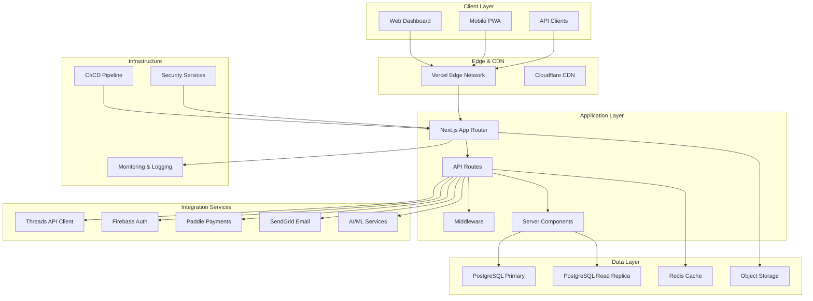
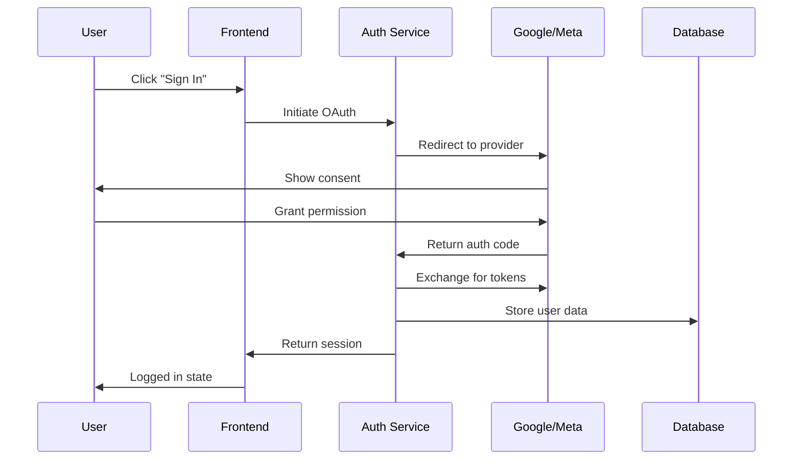
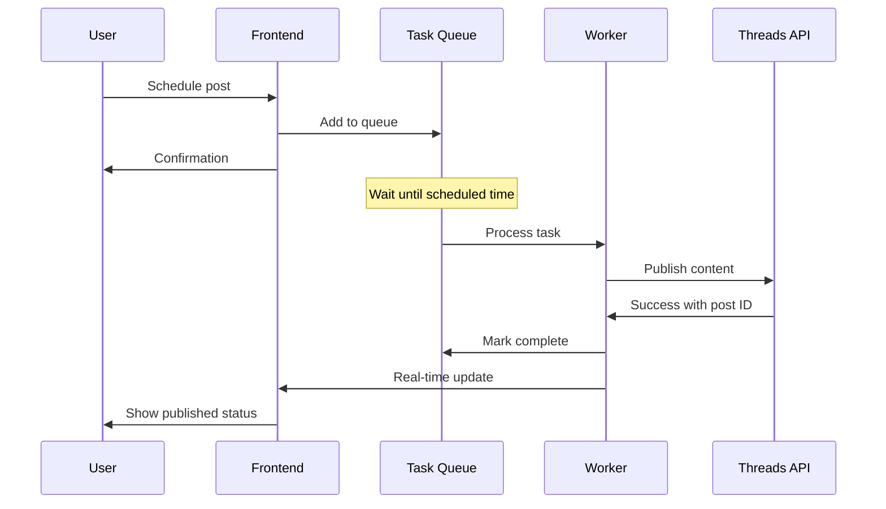

# System Architecture Overview

## Executive Summary

Threadlytics is built on a modern, scalable architecture that leverages the Next.js full-stack approach with serverless deployment capabilities. The system is designed to handle real-time analytics, automated content scheduling, and AI-powered insights while maintaining high performance and reliability.

**Architecture Style**: Full-stack Next.js with microservice-inspired patterns
**Primary Technologies**: Next.js 15, PostgreSQL, Redis, Firebase Auth
**Deployment Strategy**: Serverless on Vercel with managed databases
**Scalability Target**: 10,000+ concurrent users, 1M+ posts processed daily

---

## High-Level Architecture



---

## Core Components

### 1. Frontend Application

**Next.js 15 App Router Architecture:**

- **Server Components**: By default for optimal performance
- **Client Components**: Selective for interactive features
- **Streaming**: Progressive rendering for fast initial loads
- **Route Groups**: Logical organization without URL impact

**Component Hierarchy:**
```
app/
├── layout.tsx              # Root layout with providers
├── page.tsx               # Landing page
├── (auth)/                # Authentication routes
│   ├── login/page.tsx
│   └── register/page.tsx
├── (dashboard)/           # Main application
│   ├── layout.tsx         # Dashboard shell
│   ├── page.tsx          # Overview dashboard
│   ├── analytics/        # Analytics section
│   ├── scheduling/       # Content scheduling
│   ├── comments/         # Comment management
│   └── settings/         # User settings
└── api/                  # API routes
    ├── auth/
    ├── analytics/
    ├── scheduling/
    └── threads/
```

### 2. Backend API Layer

**API Route Organization:**

```typescript
// Route Structure
/api/auth/*           // Authentication endpoints
/api/users/*          // User management
/api/threads/*        // Threads API integration
/api/analytics/*      // Analytics data processing
/api/scheduling/*     // Content scheduling
/api/comments/*       // Comment management
/api/subscriptions/*  // Billing and subscriptions
```

**Middleware Stack:**
1. **Rate Limiting**: Prevent API abuse
2. **Authentication**: JWT token validation
3. **CORS**: Cross-origin request handling
4. **Request Logging**: Monitoring and debugging
5. **Input Validation**: Data integrity

### 3. Database Architecture

**Primary Database (PostgreSQL):**

```sql
-- Core Tables
users                  -- User accounts and authentication
threads_posts         -- Posts data and metrics
threads_comments      -- Comment data
scheduled_posts       -- Content scheduling queue
daily_analytics       -- Aggregated analytics data
user_settings         -- User preferences
subscriptions         -- Billing and plans
activity_logs         -- Audit trail
```

**Caching Layer (Redis):**

- **Session Data**: User authentication tokens
- **API Responses**: Frequently accessed data
- **Rate Limiting**: Request throttling
- **Background Jobs**: Task queue management

### 4. Integration Layer

**Threads API Integration:**
- OAuth 2.0 authentication flow
- Rate limiting compliance
- Fallback strategies for API limitations
- Data synchronization processes

**Third-Party Services:**
- **Firebase Auth**: User authentication
- **Paddle**: Subscription management
- **SendGrid**: Email notifications
- **Sentry**: Error tracking

---

## Data Flow Architecture

### 1. User Authentication Flow



### 2. Data Synchronization Flow

```mermaid
sequenceDiagram
    participant S as Scheduler
    participant T as Threads API
    participant D as Database
    participant C as Cache
    participant A as Analytics

    every 15 minutes
    S->>T: Fetch user data
    T->>S: Return posts/comments
    S->>D: Store/update data
    S->>C: Invalidate cache
    S->>A: Trigger analytics update

    loop Each Post
        S->>T: Fetch post metrics
        T->>S: Return engagement data
        S->>D: Update post analytics
        S->>C: Update cached metrics
    end
```

### 3. Content Publishing Flow



---

## Technology Stack Details

### Frontend Technologies

| Technology | Version | Purpose | Benefits |
|------------|---------|---------|----------|
| Next.js | 15.5.4 | Full-stack framework | App Router, Server Components |
| React | 19.1.0 | UI library | Latest features, concurrent rendering |
| TypeScript | 5.x | Type safety | Better development experience |
| Tailwind CSS | v4 | Styling framework | Rapid UI development |
| shadcn/ui | Latest | Component library | Professional UI components |

### Backend Technologies

| Technology | Version | Purpose | Benefits |
|------------|---------|---------|----------|
| Node.js | 18+ | Runtime environment | JavaScript ecosystem |
| Next.js API | 15.5.4 | API routes | Full-stack integration |
| PostgreSQL | 15+ | Primary database | Reliability, scalability |
| Redis | 7+ | Caching layer | Performance, session storage |
| Prisma | 5.x | ORM | Type-safe database access |

### Integration Services

| Service | Purpose | Configuration |
|---------|---------|---------------|
| Firebase Auth | Authentication | OAuth 2.0, social login |
| Threads API | Data source | Rate limiting, fallbacks |
| Paddle | Payments | Subscription management |
| SendGrid | Email | Transactional emails |
| Sentry | Monitoring | Error tracking |

---

## Security Architecture

### 1. Authentication & Authorization

**Multi-Layer Security:**
- **Session Management**: JWT tokens with refresh mechanism
- **Role-Based Access**: Subscription tier permissions
- **API Security**: Rate limiting, input validation
- **Data Protection**: Encryption for sensitive data

**Permission Matrix:**
```
Feature           Free   Creator   Professional   Business
Basic Analytics    ✓      ✓          ✓             ✓
Scheduling         ✗      ✓          ✓             ✓
Comments           ✗      ✓          ✓             ✓
AI Features        ✗      ✗          ✓             ✓
Team Access        ✗      ✗          ✗             ✓
API Access         ✗      ✗          ✗             ✓
```

### 2. Data Security

**Encryption Strategy:**
- **Data at Rest**: PostgreSQL encryption, encrypted backups
- **Data in Transit**: TLS 1.3 for all connections
- **Secrets Management**: Environment variables, key rotation
- **PII Protection**: Data anonymization, GDPR compliance

### 3. API Security

**Protection Measures:**
- **Rate Limiting**: Tier-based request limits
- **Input Validation**: Zod schemas, sanitization
- **CORS Configuration**: Restricted origins
- **SQL Injection Prevention**: Parameterized queries

---

## Performance Architecture

### 1. Caching Strategy

**Multi-Level Caching:**
```
Level 1: Memory Cache (Next.js)
├── Component state
├── API response caching
└── Static assets

Level 2: Redis Cache
├── User sessions
├── API responses
├── Computed analytics
└── Rate limiting data

Level 3: Edge Cache (Vercel)
├── Static pages
├── API responses (GET)
└── Images and assets
```

### 2. Database Optimization

**Performance Techniques:**
- **Indexing Strategy**: Optimized query performance
- **Connection Pooling**: Efficient resource usage
- **Read Replicas**: Analytics query offloading
- **Materialized Views**: Complex query optimization

### 3. Frontend Optimization

**Web Performance:**
- **Code Splitting**: Route-based component loading
- **Image Optimization**: Next.js Image component
- **Bundle Analysis**: Regular size monitoring
- **Streaming SSR**: Progressive page rendering

---

## Scalability Architecture

### 1. Horizontal Scaling

**Serverless Scaling:**
- **Edge Functions**: Geographic distribution
- **API Routes**: Automatic scaling with load
- **Database**: Connection pooling, read replicas
- **Background Jobs**: Queue-based processing

### 2. Data Scaling

**Storage Strategy:**
- **Time Partitioning**: Analytics data by date
- **Data Archival**: Cold storage for old data
- **Compression**: Efficient storage usage
- **Backups**: Automated backup and recovery

### 3. Performance Monitoring

**Key Metrics:**
- **Response Time**: <500ms (95th percentile)
- **Throughput**: 1000+ requests/second
- **Error Rate**: <1% of total requests
- **Uptime**: 99.9% availability target

---

## Deployment Architecture

### 1. Environment Strategy

**Multi-Environment Setup:**
```
Development (localhost)
├── Local database
├── Mock APIs
└── Development tools

Staging (Vercel)
├── Production-like setup
├── Staging databases
└── Integration testing

Production (Vercel)
├── Global CDN
├── Managed databases
└── Full monitoring
```

### 2. CI/CD Pipeline

**Deployment Process:**
1. **Code Quality**: Linting, formatting, type checking
2. **Testing**: Unit, integration, E2E tests
3. **Security**: Vulnerability scanning, dependency checks
4. **Build**: Optimization, bundle analysis
5. **Deploy**: Staging → Production promotion

### 3. Infrastructure as Code

**Configuration Management:**
- **Environment Variables**: Tiered configuration
- **Database Migrations**: Version-controlled schema changes
- **Infrastructure Scripts**: Automated setup and maintenance

---

## Monitoring & Observability

### 1. Application Monitoring

**Monitoring Stack:**
- **Sentry**: Error tracking and performance
- **Vercel Analytics**: Web performance metrics
- **Custom Metrics**: Business KPI tracking
- **Health Checks**: Service availability monitoring

### 2. Logging Strategy

**Structured Logging:**
```typescript
// Log Structure
{
  timestamp: "2024-01-15T10:30:00Z",
  level: "info",
  service: "threadlytics-api",
  requestId: "req_12345",
  userId: "user_67890",
  action: "analytics_fetch",
  duration: 150,
  metadata: {
    endpoint: "/api/analytics/overview",
    method: "GET"
  }
}
```

### 3. Performance Monitoring

**Key Performance Indicators:**
- **Page Load Time**: <2 seconds
- **API Response Time**: <500ms
- **Database Query Time**: <100ms
- **Cache Hit Rate**: >80%

---

## Disaster Recovery

### 1. Backup Strategy

**Data Protection:**
- **Database Backups**: Daily automated backups
- **Point-in-Time Recovery**: 30-day retention
- **Cross-Region Replication**: Geographic redundancy
- **Backup Testing**: Regular recovery drills

### 2. High Availability

**Redundancy Measures:**
- **Multi-Region Deployment**: Geographic distribution
- **Database Clustering**: Primary-replica setup
- **Load Balancing**: Traffic distribution
- **Failover Automation**: Automatic recovery

### 3. Incident Response

**Incident Management:**
- **Alerting**: Automated notifications
- **Escalation**: Tiered response procedures
- **Documentation**: Runbooks and playbooks
- **Post-Mortem**: Learning and improvement

---

## Evolution Strategy

### 1. Technology Evolution

**Future Considerations:**
- **React Server Components**: Gradual adoption
- **Edge Runtime**: Performance optimization
- **Micro-frontends**: Team scaling strategy
- **GraphQL**: API evolution path

### 2. Architecture Evolution

**Scalability Planning:**
- **Service Decomposition**: Microservices migration
- **Event-Driven Architecture**: Async processing
- **API Gateway**: Centralized management
- **Container Orchestration**: Kubernetes readiness

### 3. Business Evolution

**Platform Expansion:**
- **Multi-Platform Support**: Instagram, Twitter
- **Advanced AI**: Machine learning capabilities
- **Enterprise Features**: Team collaboration
- **Global Expansion**: Internationalization

---

## Conclusion

The Threadlytics architecture is designed for scalability, performance, and maintainability. By leveraging modern web technologies and best practices, the system can handle the complex requirements of social media analytics while providing an excellent user experience.

The modular design allows for iterative development and easy adaptation to changing requirements. The comprehensive monitoring and observability ensure operational excellence as the platform scales.

Key architectural strengths:
1. **Modern Tech Stack**: Latest versions of proven technologies
2. **Scalable Design**: Built for growth from day one
3. **Security First**: Comprehensive security measures
4. **Performance Optimized**: Multi-level caching and optimization
5. **Developer Experience**: Excellent tooling and workflows

This architecture provides a solid foundation for building a successful social media analytics platform that can scale with business growth.